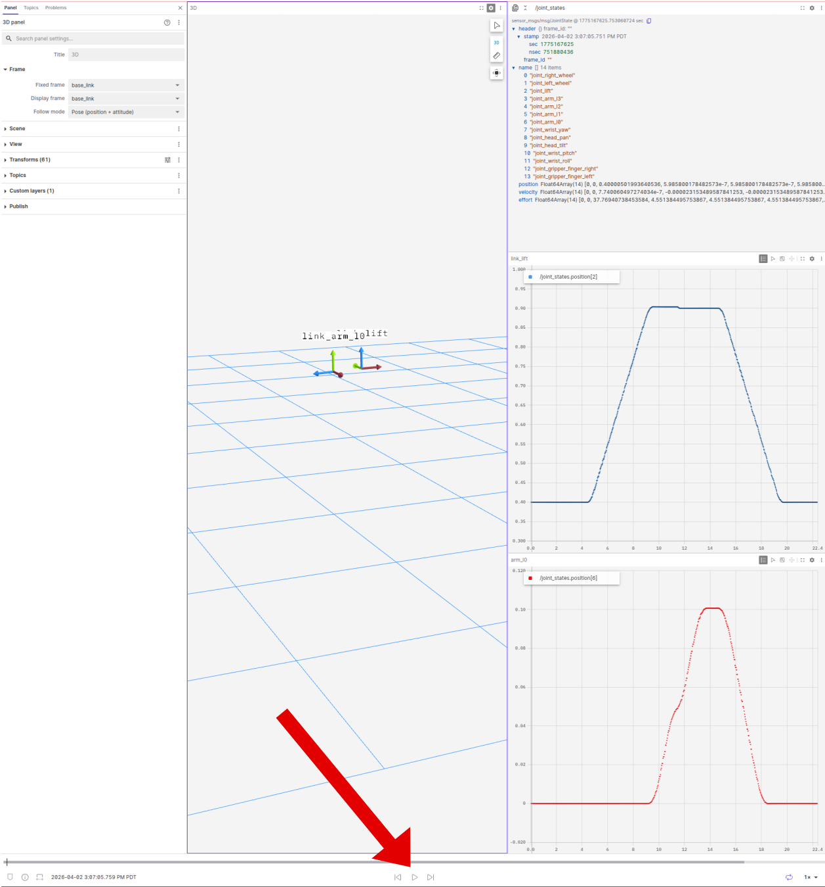

# stretch-foxglove

Use Foxglove with Hello Robot Stretch (ROS 2) for visualization and debugging.

---

# Table of Contents
 - [Requirements](#requirements)
 - [Install](#install)
 - [Test it](#test-it)
 - [Demos](#demos)
 - [Rosbag / MCAP Playback](#rosbag--mcap-playback)


---

## Requirements

### Host (Laptop)
- Foxglove Studio (desktop or browser)
- Same network as robot

### Robot (Stretch)
- ROS 2 (tested with Humble)
- Running Stretch ROS 2 stack

---

## Install

### Host — Foxglove Studio

Foxglove Studio is available on:
- Linux
- Windows
- macOS

In this guide, we use a Linux host.

Download the **x64 version** from:
https://foxglove.dev/download

Install:

```bash
sudo dpkg -i foxglove-studio-*.deb
sudo apt-get install -f
```

Test launch:

```bash
foxglove-studio
```

On first launch, you will need to sign in / log in.

### Stretch Robot — Foxglove Bridge

```bash
sudo apt update
sudo apt install ros-humble-foxglove-bridge
```

---

## Test it

#### 1. Launch Stretch Driver (Robot)

```bash
ros2 launch stretch_core stretch_driver.launch.py
```
	
#### 2. Launch Bridge (Robot)

```bash
ros2 launch foxglove_bridge foxglove_bridge_launch.xml
```

#### 3. Connect (Host)

Launch Foxglove:

```bash
foxglove-studio
```

> **Note:**
> You can also open it from the `Foxglove` Desktop App 


Once Foxglove opened:

- Click `Open connection`
- Select WebSocket and replace `<robot-ip>` with your robot's IP

	```bash
	ws://<robot-ip>:8765
	```
- Click `Connect`

> **Note:**
> You can retrieve the robot IP using:
> ```bash
> ifconfig wlo1
> ```
> Look for:
> ```bash
> inet <robot-ip>
> ```


## Demos

This section includes ready-to-use Foxglove layouts for common Stretch workflows.

Each demo is designed to be quick to launch and immediately useful for visualization and debugging.
 
You will learn how to load a layout to visualize it in Foxglove.


### Load a layout

1. Open Foxglove Studio on your host computer
2. Go to `Layouts` (left sidebar)
3. Click `+ Add` 
4. Select `Import Personal Layout`
5. Choose the layout file (`.json`) located at [stretch-foxglove/layouts](layouts/)
6. The layout will be added to the Layouts list, select it and click `Open`


### Demo 1 — Dual Camera View

<div align="center">
  
</div>

1. Launch the Foxglove Bridge (Robot):

```bash
ros2 launch foxglove_bridge foxglove_bridge_launch.xml
```

2. Run Stretch Driver:

```bash
ros2 launch stretch_core stretch_driver.launch.py
```

3. Run the Dual Camera pipeline:

```bash
ros2 launch stretch_core multi_camera.launch.py 
```

4. Load the [stretch_dual_camera.json](layouts/stretch_dual_camera.json) layout in Foxglove.

That's it, you can now visualize your data in Foxglove.


#### What you’ll see

- Head (D435i) + gripper (D405) camera feeds
- Both streams updating in real time
- Side-by-side comparison for quick debugging
- Live robot diagnostics (bottom)
- Homing status indicator (top right)
- Runstop (safety) status (top right)


### Demo 2 — Mapping + Teleop

<div align="center">
  
</div>

1. Launch the Foxglove Bridge (Robot):

```bash
ros2 launch foxglove_bridge foxglove_bridge_launch.xml
```

2. Run the Mapping pipeline:

```bash
ros2 launch stretch_nav2 offline_mapping.launch.py use_rviz:=false
```

3. Load the [stretch_mapping.json](layouts/stretch_mapping.json) layout in Foxglove.

#### What you’ll see

- Live map building as the robot moves
- Robot odometry + laser scan
- Teleop panel to drive the robot
- Live robot diagnostics (bottom)
- Homing status indicator (top right)
- Runstop (safety) status (top right)

---

## Rosbag / MCAP Playback

Foxglove can replay recorded ROS 2 data for debugging and visualization without needing the robot running.

ROS 2 data can be recorded in two formats:

- rosbag (`.db3`) — the default ROS 2 format
- MCAP (`.mcap`) — a newer, faster, and more portable format that is becoming the standard (and is well supported in Foxglove)

Both formats can be opened and replayed in Foxglove.

### Record Data

- Default ROS 2 rosbag (`.db3`):

	```bash
	ros2 bag record -o <bag_name> </topic1> </topic2>
	```

- MCAP (`.mcap`):

	```bash
	ros2 bag record -s mcap -o <bag_name> </topic1> </topic2>
	```

> **Note:** MCAP requires a one-time installation:
> ```bash 
> sudo apt update
> sudo apt install ros-humble-rosbag2-storage-mcap
> ```

### Open in Foxglove

For this example, we use a pre-recorded ROS 2 bag.

1. Open Foxglove  
2. Click `Open local file(s)`
3. Select the [stretch_debug.db3](bags/stretch_debug/stretch_debug.db3) rosbag


### Visualize the data

Once opened, you can visualize the recorded data by adding panels.

For this example, a layout is already provided.

Load the [multipoint_command_debug.json](layouts/multipoint_command_debug.json) layout to quickly get a full visualization setup.

### Play the recording

Use the playback controls at the bottom of Foxglove to **play the rosbag** and explore the data over time.

<div align="center">
  
</div>

In this example, we use the bag to debug arm joint position.

- On the right-hand side, two plots show the position of two Stretch joints:
	- the **lift joint** (blue)  
	- the **arm joint** (red)  
- At the top right, the full joint states data from the `/joint_states` topic is also displayed.

<div align="center">
  
</div>
