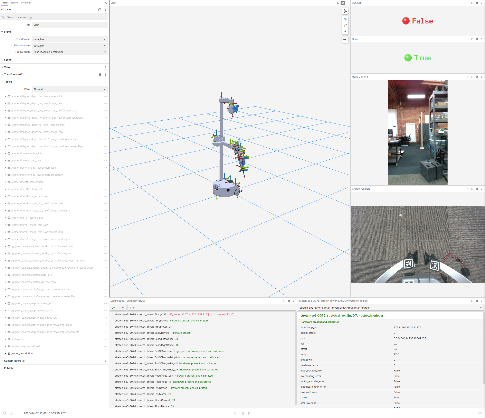

# Dual Camera View

<div align="center">
  
</div>

1. Launch the Foxglove Bridge (Robot):

```bash
ros2 launch foxglove_bridge foxglove_bridge_launch.xml
```

2. Run Stretch Driver:

```bash
ros2 launch stretch_core stretch_driver.launch.py
```

3. Run the Dual Camera pipeline:

```bash
ros2 launch stretch_core multi_camera.launch.py 
```

4. Load the layout in Foxglove

- Follow the instructions to [load a layout](load-layout.md)
- Use [stretch_dual_camera.json](layouts/stretch_dual_camera.json)


That's it, you can now visualize your data in Foxglove.


## What you’ll see

<div align="center">
  
</div>

- Head (D435i) + gripper (D405) camera feeds
- Both streams updating in real time
- Side-by-side comparison for quick debugging
- Live robot diagnostics (bottom)
- Homing status indicator (top right)
- Runstop (safety) status (top right)