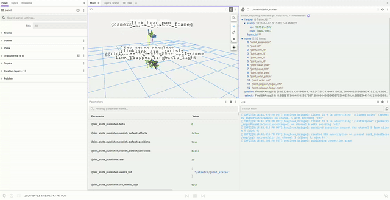
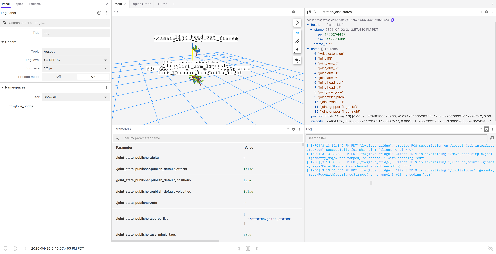
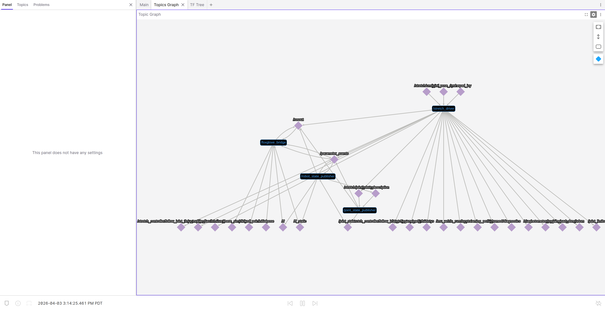
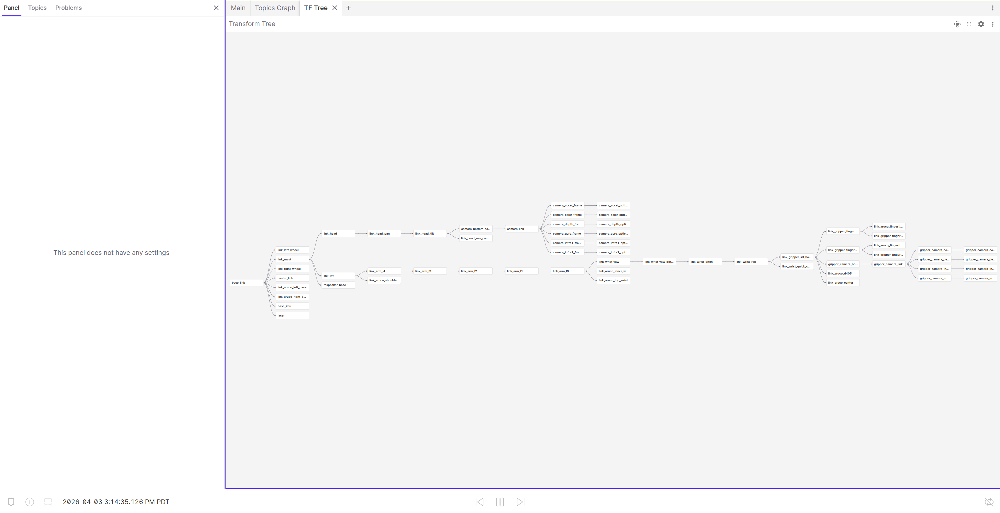

# Stretch ROS 2 System Debugging

<div align="center">
  
</div>

1. Launch the Foxglove Bridge (Robot):

```bash
ros2 launch foxglove_bridge foxglove_bridge_launch.xml
```

2. Run Stretch Driver:

```bash
ros2 launch stretch_core stretch_driver.launch.py
```

3. Load the layout in Foxglove

- Follow the instructions to [load a layout](load-layout)
- Use [system_debugging.json](layouts/system_debugging.json)

## What you’ll see

This layout is composed of three tabs, each designed for a specific aspect of ROS 2 debugging.

### 1. Main

<div align="center">
  
</div>

The main tab is split into four key areas:
- 3D view with TF visualization (top left)
- Full ROS 2 parameters panel (bottom left)
- Raw Messages for inspecting specific topics (top right)
- `/rosout` log stream for general debugging (bottom right)

### 2. Topics Graph

<div align="center">
  
</div>

- Full-screen view of the ROS 2 topic graph for system-level inspection

### 3. TF Tree

<div align="center">
  
</div>

- Full-screen TF tree for understanding frame relationships


> **Note:**
> This layout uses tabs to optimize visibility for complex debugging tools. Views like the `Topics Graph` and `TF Tree` benefit from full-screen space, making them easier to read, navigate, and analyze during debugging sessions.
