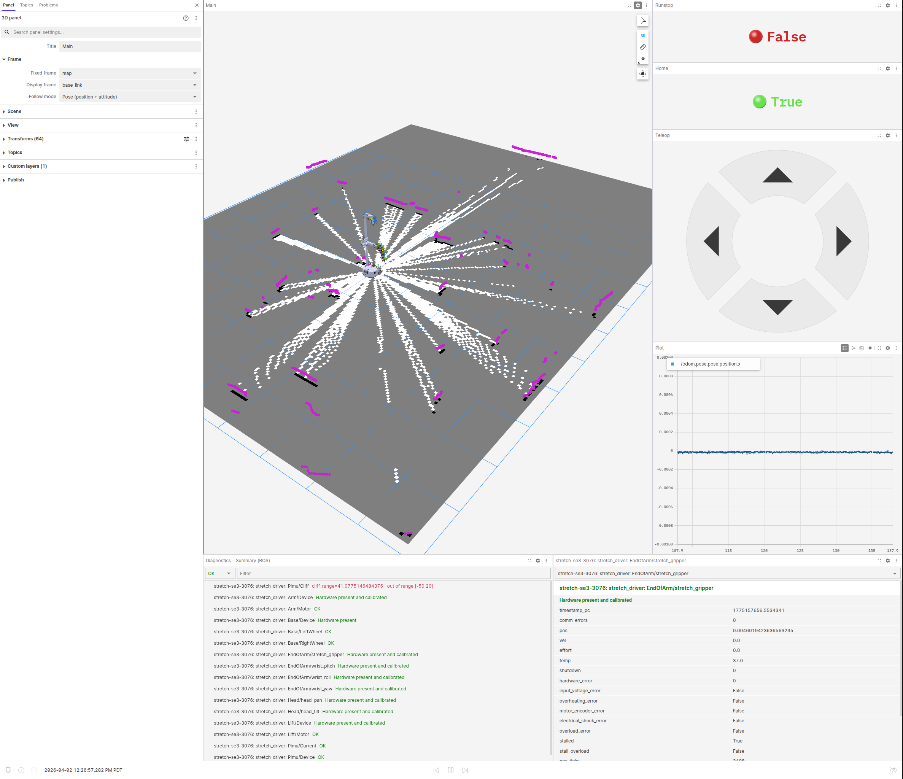

# Mapping + Teleop

<div align="center">
  
</div>

1. Launch the Foxglove Bridge (Robot):

```bash
ros2 launch foxglove_bridge foxglove_bridge_launch.xml
```

2. Run the Mapping pipeline:

```bash
ros2 launch stretch_nav2 offline_mapping.launch.py use_rviz:=false
```

3. Switch to Navigation mode in order to control with Foxglove teleop

```bash
ros2 service call /switch_to_navigation_mode std_srvs/srv/Trigger {}\
```

4. Load the layout in Foxglove

- Follow the instructions to [load a layout](load-layout.md)
- Use [stretch_mapping.json](/layouts/stretch_mapping.json)

## What you’ll see

<div align="center">
  
</div>

- Live map building as the robot moves + laser scan
- Robot odometry (right-hand side)
- Teleop panel to drive the robot (right-hand side)
- Live robot diagnostics (bottom)
- Homing status indicator (top right)
- Runstop (safety) status (top right)